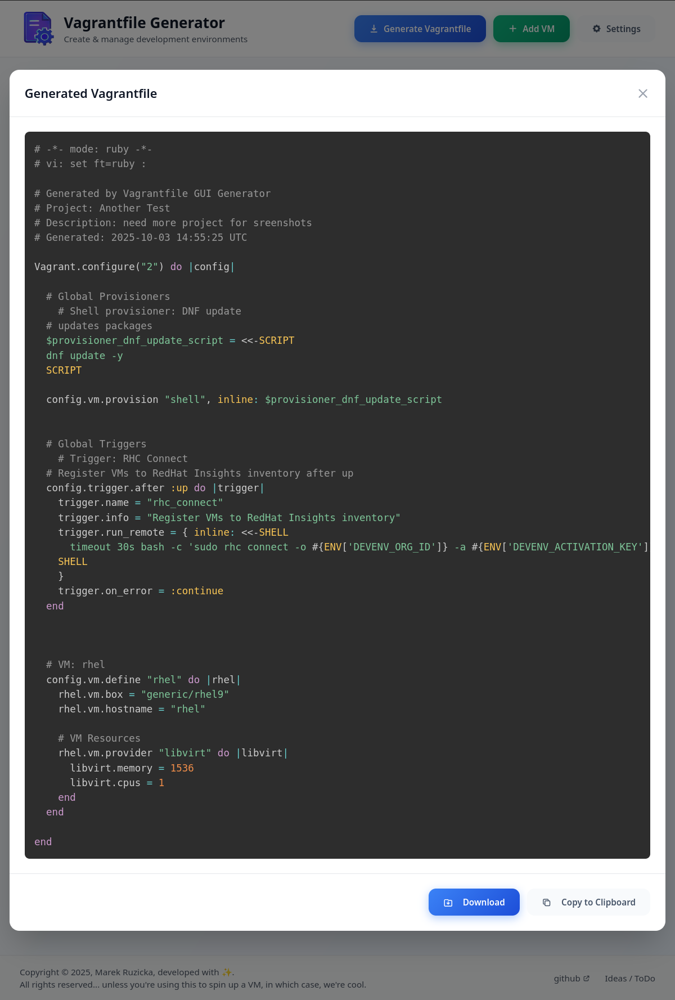

# App Overview

This is a **quick tour** of the app interface.

## Projects list / Frontpage
This is the main projects page where you can create, search and filter your Vagrant projects. Each card shows basic stats (VM count, status) and quick actions.

## Project detail
The project detail page is where you configure a project's VMs, plugins, provisioners, and triggers. Use the section headers to add or manage items for this project.

## Settings
The Settings screens let you manage global resources such as plugins, provisioners, boxes and triggers which can then be assigned to projects.

## Generated Vagrantfile preview
Preview the generated Vagrantfile for a project before using it. This helps verify expected configuration.

#### Notes

- Screenshots are taken from the running app; your data may vary.
- For instructions on running the app locally (DEV / PROD) see `docs/ENVIRONMENTS.md`.
- For recent changes see `CHANGELOG.md`.

